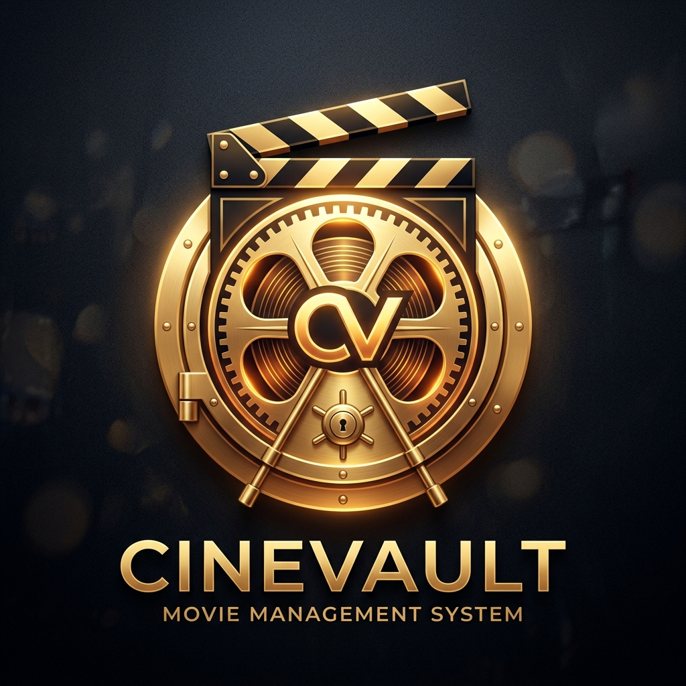

<div align="center">

<a href="https://github.com/touheed-dev/CineVault-movie-Management">
  
</a>

# 🎬 CineVault — Movie Management System

[](https://react.dev/)
[](https://vitejs.dev/)
[](https://axios-http.com/)
[](https://mockapi.io/)
[](LICENSE)

<br/>

**A full-featured Movie Management Dashboard demonstrating complete CRUD REST operations in React, connected to a live MockAPI backend.**

*Styled in the warm editorial aesthetic of [Phrase Passport](https://passport.alimustufa.com/) — featuring paper canvas backgrounds, deep forest pine ink, terracotta accents, Newsreader serif typography, and vintage passport watermarks.*

[Features](#-key-features) • [Tech Stack](#-tech-stack) • [Quick Start](#-quick-start) • [CRUD Architecture](#-crud-architecture--api-spec) • [Viva Guide](#-college-practical--viva-guide)

</div>

---

## 📖 Table of Contents

- [Overview](#-overview)
- [Key Features](#-key-features)
- [Tech Stack](#-tech-stack)
- [Project Directory Structure](#-project-directory-structure)
- [CRUD Architecture & API Spec](#-crud-architecture--api-spec)
- [Design System & Theme](#-design-system--phrase-passport-theme)
- [Quick Start & Setup](#-quick-start)
- [College Practical & Viva Guide](#-college-practical--viva-guide)
- [Code Quality & Linting](#-code-quality--linting)
- [License](#-license)

---

## 📌 Overview

**CineVault** is developed as a complete college practical web application that proves full **CREATE, READ, UPDATE, and DELETE** functionality integrated with an external cloud REST API.

- **MockAPI Resource Endpoint**:
  ```text
  https://6aba51f75b549d818d624667.mockapi.io/api/v1/movies
  ```
- **No Mock Databases**: No local JSON files or in-memory mock objects are used as the backend. Every interaction issues genuine HTTP network requests (`GET`, `POST`, `PUT`, `DELETE`).

---

## 🌟 Key Features

### 1. 🔄 Complete CRUD REST Operations
- **CREATE (`POST`)**: Add new movies through an interactive modal with live client-side validation.
- **READ (`GET`)**: Fetch and render all live movie records on initial load and manual refresh.
- **UPDATE (`PUT`)**: Edit existing records with pre-populated form controls using the exact MockAPI generated `id`.
- **DELETE (`DELETE`)**: Delete movies after explicit user confirmation in a dedicated dialog.

### 2. 🌍 Global World Cinema Dataset & Batch Seeder
- Includes a rich, curated dataset of **33+ international masterpieces** from Japan, South Korea, France, Italy, Spain, Brazil, Germany, Denmark, Hong Kong, Iran, India, and the US/UK.
- Clicking **"⚡ Add Global Samples"** intelligently filters out movies already present in the database and seeds **4 brand-new international titles** from different regions via live `POST` requests.

### 3. 📊 Live Aggregate Dashboard Vouchers
- **Total Films**: Real-time count of titles in MockAPI.
- **Average Rating**: Dynamic calculation rounded to 1 decimal place (`/ 5.0`).
- **Global Engagement**: Total cumulative audience views formatted with locale commas.
- **Top Rated Feature**: Displays the highest-rated movie title and score.

### 4. 🔍 Search, Filter & Multi-Criteria Sorting
- **Dynamic Search**: Instant filtering across `title`, `genre`, and `language` simultaneously.
- **Dynamic Genre Filter**: Dropdown options extracted automatically from loaded movies.
- **Sorting Options**:
  - Title: A – Z
  - Rating: High to Low / Low to High
  - Year: Newest / Oldest
  - Views: High to Low

### 5. 🛡️ Robust Validation & Poster Fallbacks
- Input validation prevents empty titles, missing genres/languages, invalid years (`1888`–`2036`), ratings outside `0.0`–`5.0`, and negative views.
- Missing or broken image URLs automatically render a clean, branded monogram stamp placeholder instead of a broken image icon.

### 6. 📡 Real-time REST Inspector Bar
- Prominent top status indicator displaying the active MockAPI endpoint, current HTTP verb, and response status (e.g., `GET /movies — 200 OK`, `POST /movies — 201 Created`).

---

## 💻 Tech Stack

| Technology | Purpose |
|---|---|
| **React 19** | Component-driven UI and state management (`useState`, `useEffect`, `useMemo`, `useCallback`) |
| **Vite 8** | Modern build tool and fast HMR development server |
| **Axios** | Dedicated Promise-based HTTP client for centralized REST operations |
| **Vanilla CSS3** | Custom design system matching the Phrase Passport editorial theme |
| **Google Fonts** | *Newsreader* & *Playfair Display* (Editorial Serifs), *Plus Jakarta Sans* (UI Sans) |
| **MockAPI** | Cloud REST API service providing live `/movies` endpoint |

---

## 📁 Project Directory Structure

```text
EXP10Wmad/
├── public/
│   ├── favicon.jpg              # Custom CineVault vault & film reel favicon
│   └── logo.jpg                 # High-resolution brand emblem
├── src/
│   ├── components/
│   │   ├── ConfirmDialog.jsx    # Modal dialog for DELETE confirmation
│   │   ├── Header.jsx           # Wordmark, REST badge, sample seeder & Add button
│   │   ├── MovieCard.jsx        # Guide card with poster fallback & isolated buttons
│   │   ├── MovieForm.jsx        # Reusable modal form for CREATE (POST) and UPDATE (PUT)
│   │   ├── MovieGrid.jsx        # Grid container handling Loading, Error, and Empty states
│   │   ├── SearchBar.jsx        # Real-time search, dynamic genre filter, & sort dropdown
│   │   ├── Stats.jsx            # Live aggregate dashboard vouchers (Total, Avg, Views, Top)
│   │   └── Toast.jsx            # Auto-dismissing success & error notifications
│   ├── data/
│   │   └── worldCinemaDataset.js # 33+ international films dataset & batch selector
│   ├── services/
│   │   └── movieService.js      # Centralized Axios API service with all CRUD methods
│   ├── App.jsx                  # Main application state container & REST tracker
│   ├── index.css                # Phrase Passport design system & responsive layout
│   └── main.jsx                 # React root entry point
├── .gitignore                   # Clean Git ignore rules (node_modules, dist, logs)
├── .oxlintrc.json               # Linter configuration
├── index.html                   # HTML entry point with fonts & metadata
├── package.json                 # Project dependencies & npm scripts
├── README.md                    # Project documentation & viva guide
└── vite.config.js               # Vite configuration
```

---

## 🔌 CRUD Architecture & API Spec

All API calls are centralized in [`src/services/movieService.js`](file:///w:/EXP10Wmad/src/services/movieService.js).

| Operation | HTTP Verb | Endpoint | Description |
|---|---|---|---|
| **READ ALL** | `GET` | `/movies` | Fetches all movies from MockAPI |
| **READ ONE** | `GET` | `/movies/:id` | Fetches a single movie by ID |
| **CREATE** | `POST` | `/movies` | Creates a new movie record (`id` auto-generated) |
| **UPDATE** | `PUT` | `/movies/:id` | Updates an existing movie record |
| **DELETE** | `DELETE` | `/movies/:id` | Deletes a movie record by ID |

### Resource Schema
```json
{
  "id": "1",
  "createdAt": "2026-09-28T12:00:00.000Z",
  "title": "Inception",
  "genre": "Sci-Fi",
  "year": 2010,
  "rating": 4.7,
  "language": "English",
  "views": 450000,
  "posterUrl": ""
}
```

---

## 🎨 Design System — Phrase Passport Theme

Inspired by [passport.alimustufa.com](https://passport.alimustufa.com/):

```css
:root {
  --paper: #f3ecdf;           /* Warm parchment canvas */
  --paper-light: #fbf7ef;     /* Elevated voucher & card surface */
  --ink: #102d2b;             /* Deep forest pine ink */
  --ink-soft: #36514d;        /* Subtitles & editorial metadata */
  --terracotta: #b55235;      /* Burnt sienna accents & italic highlights */
  --terracotta-dark: #893923; /* Delete button hover */
  --jade: #337064;            /* Status pills & REST badges */
  --line: rgba(16, 45, 43, 0.18); /* 1px connected grid borders */
}
```

### Visual Highlights
- **Connected 1px Borders**: Guide cards and vouchers share a single cohesive 1px ink border grid.
- **Isolated Delete Button**: Solid opaque surface (`var(--paper-light)`) with elevated `z-index`, preventing the decorative watermark circle from cutting the button text in half.
- **Editorial Typography**: Large serif headlines (*Newsreader*, *Playfair Display*) with italic terracotta accents and uppercase tracked eyebrows.

---

## 🚀 Quick Start

### Prerequisites
- [Node.js](https://nodejs.org/) (version 18 or higher)
- npm or yarn

### 1. Clone the Repository
```bash
git clone https://github.com/<your-username>/cinevault-movie-management.git
cd cinevault-movie-management
```

### 2. Install Dependencies
```bash
npm install
```

### 3. Run Development Server
```bash
npm run dev
```
Open **[http://localhost:5173/](http://localhost:5173/)** in your browser.

### 4. Build for Production
```bash
npm run build
npm run preview
```

---

## 🎓 College Practical & Viva Guide

### Frequently Asked Viva Questions

#### Q1: Where does the CREATE operation happen in code?
- **UI**: The user clicks `+ Add Movie` in [`Header.jsx`](file:///w:/EXP10Wmad/src/components/Header.jsx).
- **Form**: [`MovieForm.jsx`](file:///w:/EXP10Wmad/src/components/MovieForm.jsx) validates inputs and invokes `onSubmit(formData)`.
- **App**: `handleFormSubmit()` in [`App.jsx`](file:///w:/EXP10Wmad/src/App.jsx) delegates to `movieService.createMovie(formData)`.
- **Axios**: Executes `POST https://6aba51f75b549d818d624667.mockapi.io/api/v1/movies`.
- **Sync**: Form closes, success toast displays, and `fetchMovies()` re-reads from MockAPI.

#### Q2: How does the UPDATE operation target a specific movie?
- When the user clicks `Edit` on a card in [`MovieCard.jsx`](file:///w:/EXP10Wmad/src/components/MovieCard.jsx), the `movie` object containing the unique MockAPI `id` is passed to `handleOpenEditModal(movie)`.
- The form pre-populates with existing values.
- On submission, `movieService.updateMovie(movieToEdit.id, formData)` executes `PUT /movies/:id`.

#### Q3: How is data deletion safely handled?
- Clicking `Delete` opens [`ConfirmDialog.jsx`](file:///w:/EXP10Wmad/src/components/ConfirmDialog.jsx), asking: *"Are you sure you want to delete this movie?"*.
- If confirmed, `movieService.deleteMovie(id)` executes `DELETE /movies/:id`.
- The UI triggers `fetchMovies()` to refresh the state and recomputes the statistics vouchers.

#### Q4: Why is there a dedicated service file (`movieService.js`)?
- **Separation of Concerns**: UI components handle user interaction and rendering, while `movieService.js` handles HTTP transport, error interception, payload sanitization, and base URLs. This makes testing and maintenance simple.

#### Q5: What React hooks are used and why?
- `useState`: For local component state (movies list, form inputs, active filters, modal visibility).
- `useEffect`: For fetching movies on mount and listening to the `Escape` key on modals.
- `useCallback`: For memoizing `fetchMovies` to avoid unnecessary re-creations.
- `useMemo`: For computing aggregate statistics and filtering/sorting movie lists efficiently.

---

## 🧪 Code Quality & Linting

Verify lint rules and production build:
```bash
# Run Oxlint
npm run lint

# Run Vite production build
npm run build
```

- **Build**: Passes cleanly with 0 errors.
- **Lint**: 0 warnings and 0 errors across all 13 project files.

---

## 📄 License

This project is open-source under the [MIT License](LICENSE).
Feel free to use it for academic demonstrations, college practicals, and portfolio showcases!
